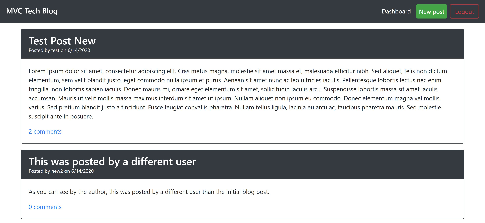

# Tech Blog 

## Description
This is a tech blog created using Model View Controller design. The Sequelize Models are separate from the Handlebars Views, which are separate from the Express Controllers (routes).

## Table of Contents
* [Installation](#Installation)
  
* [Usage](#Usage)

* [License](#License)

* [Questions](#Questions)

## Installation
Installation instructions listed below:
```
npm init -y
npm install
```
  
## Usage
Create a file named .env in the parent directory for server.js with the line process.env.DB_NAME = 'YOUR_DB_NAME', DB_USER = 'YOUR_USERNAME', DB_PW = 'YOUR_PASSWORD', and DB_COOKIE = 'SECRET_KEY' where everything corresponds to your MySQL information and your desired secret key. After running npm init and npm install, follow the below commands.

```
mysql -u root -p
source db/schema.sql
npm start
```

[](https://www.youtube.com/embed/0IZsfHIpZ3M)

## License
A short and simple permissive license with conditions only requiring preservation of copyright and license notices. Licensed works, modifications, and larger works may be distributed under different terms and without source code.

To view the full license, [click here](./src/license/MIT.txt).

## Questions
If you have any questions, you can find me at [aelisker](https://github.com/aelisker) and via email at [alisker@protonmail.com](mailto:alisker@protonmail.com).
    